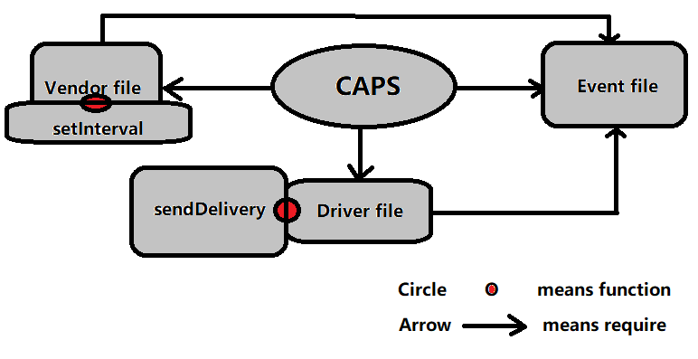

# lab 16
# PROJECT CAPS 

### Author: Ahmed Abu Samaan

### Resources
[PR](https://github.com/AhmedAbuSamaan-401-advanced-javascript/caps/pull/1)

### Setup (.env):-
.env

### How to run your application
1. nodemon
2. node index.js

### Libraries:
1. faker
2. dotenv

### CAPS UML

